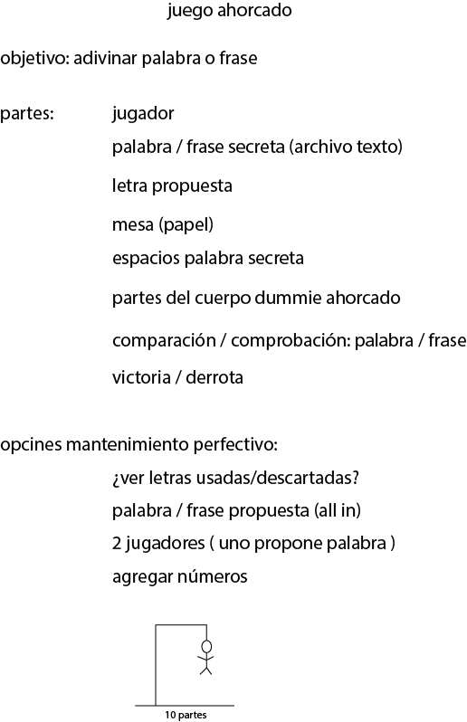
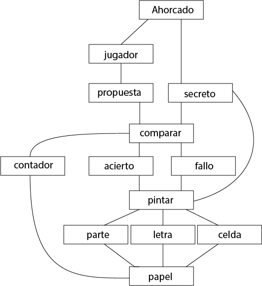

### Brain Stroming inicial

###### Palabras clave

###### Propuesta de un diagrama de flujo no software

###### Más ideas para mantenimiento perfectivo:
1. undo/redo
2. persistencia
3. suministrar archivo con palabras (texto) por el usuario
4. juego en red
5. cambiar dificultad (otro personaje ahorcado con menos o más partes)
6. lista de idiomas disponible