# Domain model
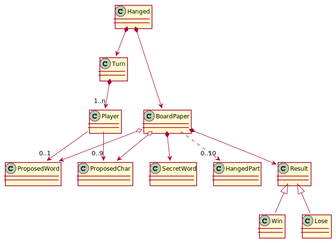

# Actors
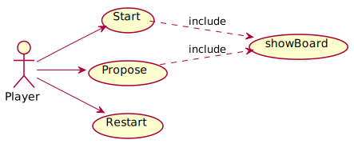

# Context Diagram
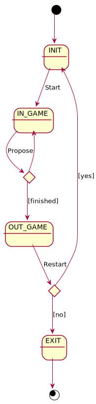

# Specifications use case
# Start
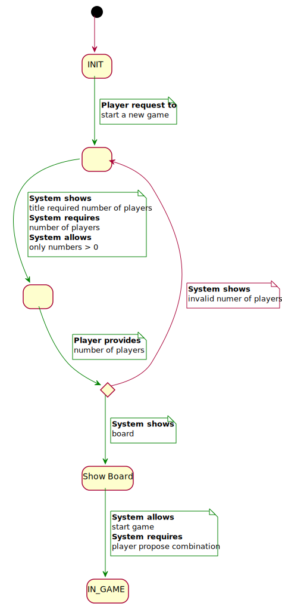
# Propose
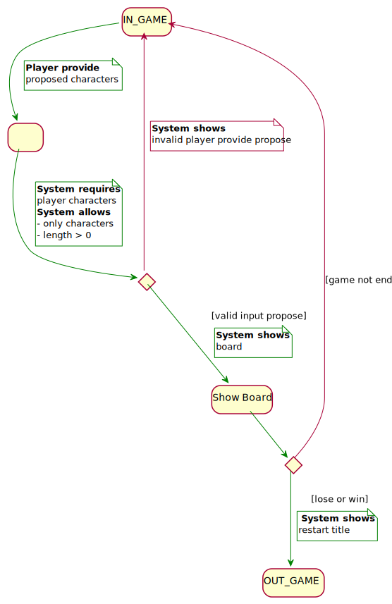
# Restart
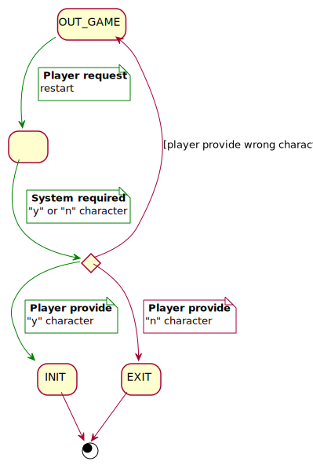

# MVC (wip)
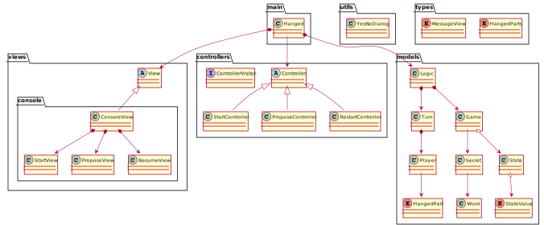
# Analysis Architecture RUP
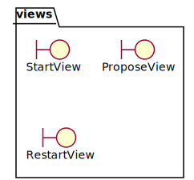
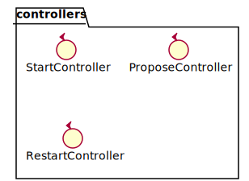
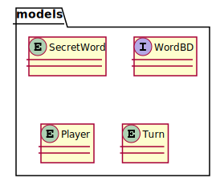

# Initial State of Object Diagram (wip)
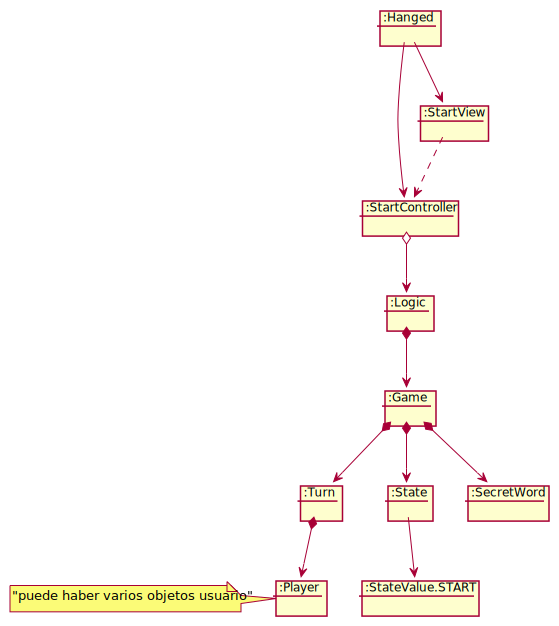

# Console GUI
[GUI prototype](useCase/consoleInterfaceUseCase.txt)